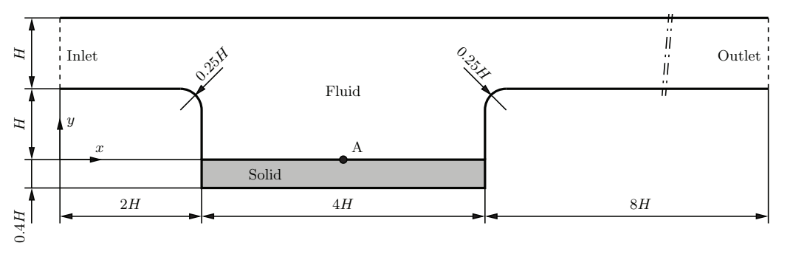
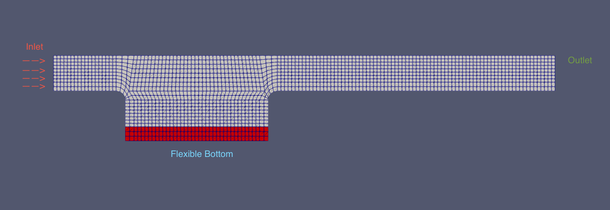
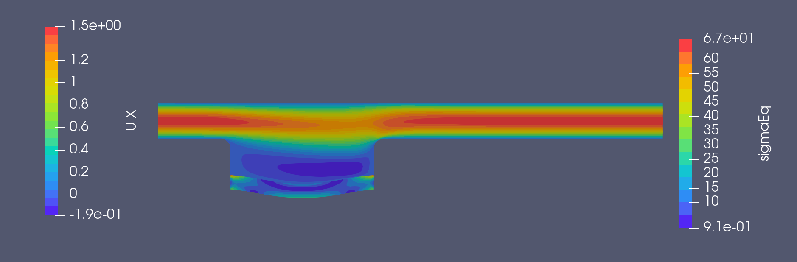
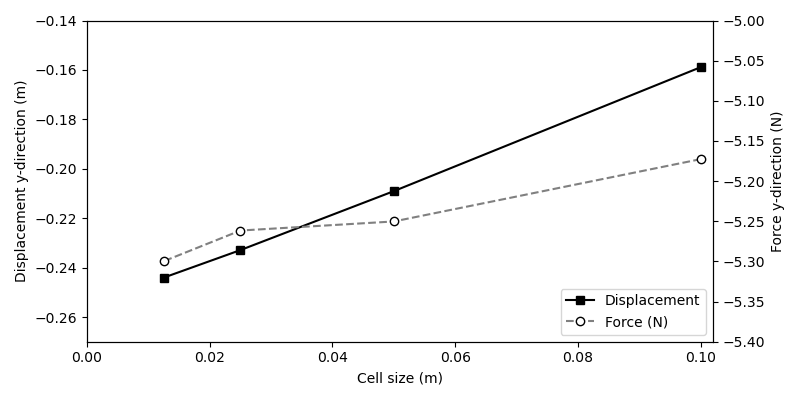
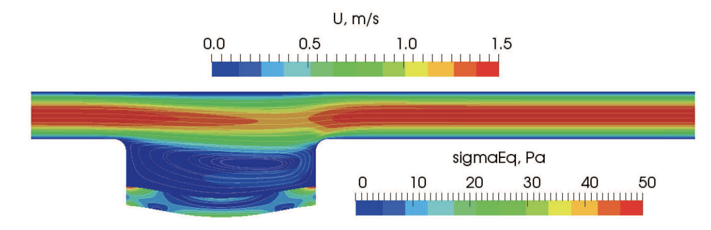
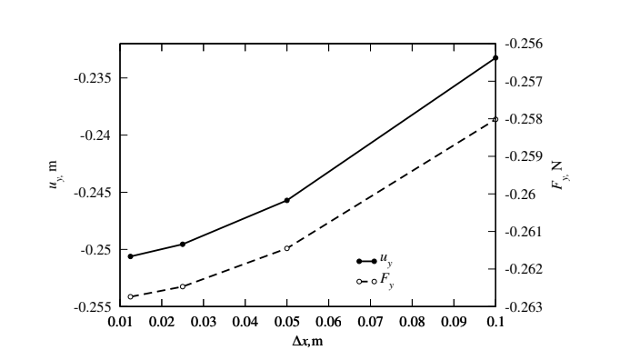
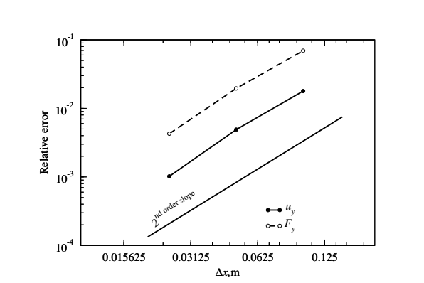

# Channel flow over a cavity with a flexible bottom
Prepared by Aaron Mullen-Hales and Philip Cardiff
## Tutorial Aims
* Demonstrates how to perform a simple fluid-solid interaction simulation
## Case Overview
This case involves a laminar flow of an incompressible fluid over with a parabolic velocity profile at the inlet which flows through a 2D channel with a flexible cavity in the bottom wall of the channel. The geometry of the fluid and solid parts are shown in Fig. 1. The height of the performed calculations is $H=1m$. The case involves a fluid with a desnsity of $1 kg/m^3$ and a kinematic viscosity of $0.01 m^2 /s$ flowing into the channel from the left hand side with a parabolic velocity profile with a mean inlet velocity of $1 m/s$. This corresponds too a Reynolds number of 100 with respect to the channel height. A constant pressure is imposed at the outlet of the channel and a no-slip boundary condition is applied to the channel walls. The flexible elastic plate at the bottom of the cavity has a density of $1000 kg/m^3$, Young's modulus of $500 N/m^2$, Poisson's ratio of $0.4$ and its deformation is described by the Saint Venant-Kirchhoff constitutive model.

Althoufh the steads-state solution is of interest, the case is setup to solve transiently in time until steady-state is achieved. Accordingly, 1st order `Euler` time discretisation schemes are chosen for the fluid (`system/fluid/fvSchemes`) and the solid (`system/solid/fvSchemes`) as they contain significant numerical damping, aiding convergence to steady state. In addition, damping is added to the solid (`dampingCoeff` in `constant/solid/solidProperties`) to aim convergence to the steady state.

Convergence of the fluid-solid interaction residuals can be monitored via the `residuals/fsiResiduals.dat` file.

    
    <figcaption>Figure 1: Geometry of the spatial computational domain for the channel flow over a cavity with a flexible bottom.</figcaption>

    
    <figcaption>Figure 2: Discretised spatial domain for the channel flow over a cavity.</figcaption>

This case is described in Tuković, Ž., Karač, A., Cardiff, P., Jasak, H., &
 Ivanković, A. (2018). OpenFOAM finite volume solver for fluid-solid interaction.
 Transactions of FAMENA, 42(3), 1-31. https://doi.org/10.21278/TOF.42301.
<!--
## Notes
Although the steady-state solution is of interest,
The case is setup to solve transiently in time until steady-state is reached.
 Accordingly, 1st order `Euler` time discretisation schemes are chiosen for the
 fluid (`system/fluid/fvSchemes`) and the solid (`system/fluid/fvSchemes`) as
 they contain significant numerical damping, aiding convergence to steady state.
 In addition, damping is added to the solid (`dampingCoeff` in
 `constant/solid/solidProperties`) to aim convergence to the steady state.

Convergence of the fluid-solid interaction residuals can be monitored via the
 `residuals/fsiResiduals.dat` file.
-->

## Running the case
The tutorial case is located at `solids4foam/tutorials/fluidSolidInteraction/...`. Note that this case is run on the `feature-petsc-snes` branch of solids4foam and requires petsc to be installed. The case can be run using the included Allrun script i.e. `> ./Allrun`. The `Allrun` script first executes `blockMesh` for both the solid and fluid domains (`> blockMesh -region solid` and `> blockMesh -region fluid`), and then the `solids4foam` solver is used to run the case (`> solids4Foam`).

## Analysing Results
The vertical displacement of point A (`(4 -1 0)`) are recorded in `postProcessing/0/solidPointDisplacement_displacement.dat`
 via the function object defined in `system/controlDict`. The forces on the interface are also recorded in the `postProcessing/fluid/forces/0/force.dat` via the same function object.  These predictions can
 be compared with the predictions from Tukovic et al.

 In Figure 3 below the final timestep for the finest mesh is shown for the fluid velocity in the $x-direction$ with the stress shown on the elastic plate. 

 An analysis was made for the plots of the displacement at point A and the forces on the interface vs different cell lengths of the mesh. The coarsest mesh had a cell length of approximately $0.1m$ and then the mesh was refined by dividing this cell size by $2$ until the finest mesh was analysed with a cell length of approximately $0.0125m$. Results for this can be seen in Figure 4.

 Finally the relative error was plotted where we compare the results of other cell sizes to the finest mesh which can be seen in Figure 5... Note that this still needs to be done once were satisfied with the results.

    
    <figcaption>Figure 3: Velocity field in the fluid and equivalent stress in the solid part of the spatial computational domain at the final time step for the channel flow over a cavity with a flexible bottom.</figcaption>

    
    <figcaption>Figure 4: Displacement and force as a function of cell size.</figcaption>

## Results from the paper
The paper gives similar results for the plots shown above. In Figure 6 we see the papers results for the velocity field and equivalent stress, in Figure 7 we see the plots for the displacement and forces and finally in Figure 8 we see the relative error.

    
    <figcaption>Figure 6: Velocity field in the fluid and equivalent stress in the solid part of the spatial computational domain at the final time step for the channel flow over a cavity with a flexible bottom (from paper).</figcaption>

    

        
        <figcaption>Figure 7: Displacement and force as a function of cell size (from paper).</figcaption>
    

    

        
        <figcaption>Figure 7: Relative error as a function of cell size (from paper).</figcaption>
    

## References
[1] https://www.researchgate.net/publication/328411974_OpenFOAM_Finite_Volume_Solver_for_Fluid-Solid_Interaction

